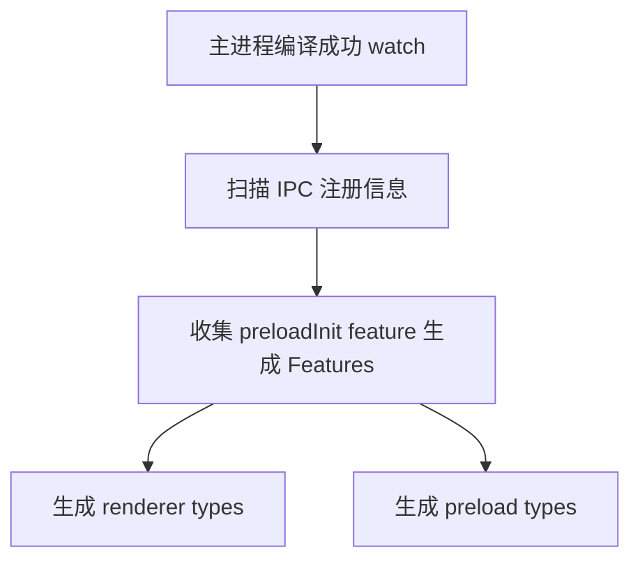

# 进程通信（IPC）

- 包路径：`package/electron/src/ipc`
- 模块名称：`@package/electron`（预加载：`@package/electron/preload`）
- 主进程导出：`ipc`（`IpcConnector` 的单例封装）
- 预加载导出：`preloadInit(feature?: string)` 暴露 `window.ipc`

## 预加载模块（renderer）

- `ipc.send(channel: string, ...args: unknown[])`
  - 向主进程发送原始消息，触发主进程通过 `ipcMain.on(channel)` 注册的监听
  - 无返回值；用于不需要结果的通知类消息

- `ipc.on(name: string, callback: (...args: unknown[]) => void)`
  - 监听主进程发往当前窗口的消息（如主进程的 `ipc.send(name, ...)` 或事件型频道广播）
  - 回调仅接收业务参数；如需取消监听请使用下方“动态事件方法”返回的 `off`

- `ipc.once(name: string, callback: (...args: unknown[]) => void)`
  - 行为同 `on`，但首次触发后自动移除监听

- `ipc[channel](...args): Promise<unknown>`（亦可用 `window.ipc[channel]`）
  - 动态请求方法，对应主进程 `response(channel)`
  - 基于 `ipcRenderer.invoke` 发起请求，返回 `Promise`
  - 主进程抛错或拒绝会传递为渲染端 `Promise` 拒绝

- `ipc[channel](...args, options?, callback) => [off]`（亦可用 `window.ipc[channel]`）
  - 动态事件方法，对应主进程 `on(channel)`
  - `callback(...payload)` 接收业务参数；返回 `[off]` 用于取消监听
  - `options.once?: boolean`：是否一次性监听，默认 `false`
  - `options.private?: boolean`：是否私有动作通道（避免全局污染），默认 `true`
  - 返回值为数组，含单个 `off: () => void` 用于取消监听

::: tip 提示
预加载已在 `renderer/types/global.d.ts` 声明全局别名，可省略 `window.` 直接使用 `ipc.send`、`ipc.on`、`ipc.once`、`ipc[channel]` 等；同时可通过 `ipc.feature` 读取当前窗口的特性标记。
:::

示例：

```ts
// 预加载（preload）
import { preloadInit } from '@package/electron/preload'
preloadInit('chat')

// 渲染进程（renderer）
window.ipc.on('notify', (msg) => {
  // ...
})

const [off] = window.ipc.notify('Hello', { once: true }, (ack) => {
  // ...
})
off()

const result = await window.ipc.getUser('id-001')

// 也可使用已声明的全局别名，省略 window：
ipc.broadcast('hello')
console.log('feature:', ipc.feature)
```

## 主进程模块（main）

- `ipc.response(channel, handler, features?)`
  - 注册请求频道；`handler(event, ...args): Promise | unknown`
  - 渲染端以 `ipc[channel](...args)` 调用（基于 `ipcRenderer.invoke`），返回 `Promise`
  - 支持 `features` 归类；未指定为公共频道；重复注册同名频道会抛错
  - `handler` 抛错或返回被拒绝的 `Promise` 会传递到渲染端的 `Promise` 拒绝

- `ipc.on(channel, listener, features?)`
  - 注册事件频道；`listener(event, ...args, reply): unknown`
  - 渲染端以 `ipc[channel](...args, options?, callback)` 触发事件；`callback(...payload)` 接收业务参数
  - 回执机制：
    1. 渲染端调用时会生成 `action`：`options.private === true` → `channel-<uuid>`；否则 `channel`
    2. 渲染端在该 `action` 上注册监听（`once` 或常驻），并向主进程发送 `channel`，首参为 `action`
    3. 主进程中 `reply(...payload)` 会把数据发回到这个 `action`
    4. 当 `options.private === true` 时，只有本次调用的渲染端回调能收到；当为 `false` 时，任何监听 `channel` 的渲染端均可收到
  - 典型用法：
    1. 一次性回执：`{ once: true, private: true }` — 仅当前调用者收到，且回调触发一次
    2. 广播式回执：`{ once: false, private: false }` — 所有监听该频道的窗口都会收到
  - 支持 `features` 归类；未指定为公共频道；重复注册同名频道会抛错

- `ipc.send(channel, ...args)`
  - 主动向所有窗口广播事件型消息；渲染端通过 `ipc.on(channel, callback)` 接收
  - 适合系统级通知或心跳类消息

- `ipc.sendByIds(channel, ...args, targetWindowIds: number[])`
  - 定向向指定窗口集合发送事件型消息；`targetWindowIds` 可结合窗口管理模块获取

- `ipc.sendByNotIds(channel, ...args, excludedWindowIds: number[])`
  - 广播到除指定窗口外的所有窗口；常用场景为跨窗口状态同步（例如 Pinia 同步）

- `ipc.getListeners(feature?)`
  - 返回已注册的事件频道列表；可按 `feature` 过滤

- `ipc.getHandles(feature?)`
  - 返回已注册的请求频道列表；可按 `feature` 过滤

- `ipc.getRendererListeners()`
  - 返回渲染端声明的事件型频道（用于调试或文档生成）

示例：

```ts
import { ipc } from '@package/electron'

ipc.response('getUser', async (_event, id: string) => {
  return { id, name: 'Alice' }
})

ipc.on('notify', (_event, text: string, reply) => {
  reply('ok')
})

ipc.send('broadcast', 'system online')
ipc.sendByIds('notify', 'hi', [mainWindow.id])
ipc.sendByNotIds('notify', 'hi others', [mainWindow.id])
```

## 通信示例

::: code-group

```ts [main]
import { ipc } from '@package/electron'

ipc.response('getUser', async (_event, id: string) => {
  return { id, name: 'Alice' }
})

ipc.on('notify', (_event, text: string, reply) => {
  reply(`ack:${text}`)
})

ipc.send('broadcast', 'system online')
```

```ts [preload]
import { preloadInit } from '@package/electron/preload'
preloadInit('chat')
```

```ts [renderer]
const user = await ipc.getUser('id-001')

const [off] = ipc.notify('Hello', { once: true, private: true }, (ack) => {})
off()

ipc.on('broadcast', (msg) => {})
```

:::

## Features（特性隔离）

- `features?: Features` 仅对 `ipc.on` 与 `ipc.response` 生效，用于为频道归类。
- `preloadInit(feature)` 只会拿到：
  - 该 `feature` 归类下的频道
  - 以及未指定 `features` 的公共频道
- 未匹配的 `feature` 不会暴露相应频道；不同窗口可通过不同 `feature` 实现接口隔离。

示例：

```ts
// main
ipc.on('notify', listener, ['chat'])
ipc.response('getUser', handler, ['chat'])
// 公共频道（不带 features）
ipc.on('broadcast', listener)
ipc.response('ping', handler)

// preload（渲染窗口 A）
preloadInit('chat') // 将获得 notify / getUser 以及公共频道 broadcast / ping

// preload（渲染窗口 B）
preloadInit('settings') // 不会获得 notify / getUser（仅有公共频道 broadcast / ping）

// renderer（两窗口均可使用的公共频道）
window.ipc.broadcast('hello')
await window.ipc.ping('health')
```

## 设计要点

- 所有频道去重注册，重复注册会抛错。
- 事件频道会在渲染端生成临时 `action`，支持 `once` 与 `private`。
- 请求频道通过 `ipcMain.handle` 实现，渲染端以 `invoke` 发起请求。

## 错误处理与清理

- 请求错误传递：主进程的 `ipc.response` 处理函数抛错或返回拒绝的 `Promise`，会传递为渲染端 `ipc[channel]` 的 `Promise` 拒绝，应在渲染端使用 `try/catch` 或 `.catch()` 处理。
- 事件清理：动态事件方法返回 `[off]`，建议在组件卸载或路由切换时调用以避免内存泄漏；若使用 `ipc.on(name, callback)` 的常驻监听，请自行管理移除。
- 频道命名：统一使用小写加短横线（如 `get-user`、`notify`），避免与 DOM/框架事件名冲突；公共频道不加 `features`。

## 类型自动生成（TS 提示）

- 开发模式下，主进程编译完成会自动扫描 `IpcConnector.response/on` 的注册信息并生成类型。
- 生成位置：
  - 渲染端类型：`renderer/types/ipc.d.ts`
  - 预加载类型：`package/electron/types/preload.d.ts`
- 触发条件：运行主进程开发命令（`@electron/main:dev`），监听编译成功后生成。
- 代码入口：`electron/main/tsup.config.ts` 的 `onSuccess` 钩子会调用 `getIpcTypes` 与 `createIpcTypeFile`。

使用方式示例（渲染端）：

```ts
// 例如在 renderer 的某个 .d.ts 中：
import type { Ipc } from '@/types/ipc'

declare global {
  interface Window {
    ipc: Ipc
  }
}
```

这样即可在 `window.ipc.xxx` 上获得完整的 TS 提示与参数/返回类型约束。

### 类型生成流程



说明：类型生成在主进程构建的 `onSuccess` 钩子中触发，仅在开发模式 watch 时自动执行；由 `electron/main/tsup.config.ts` 调用类型扫描与写入。
